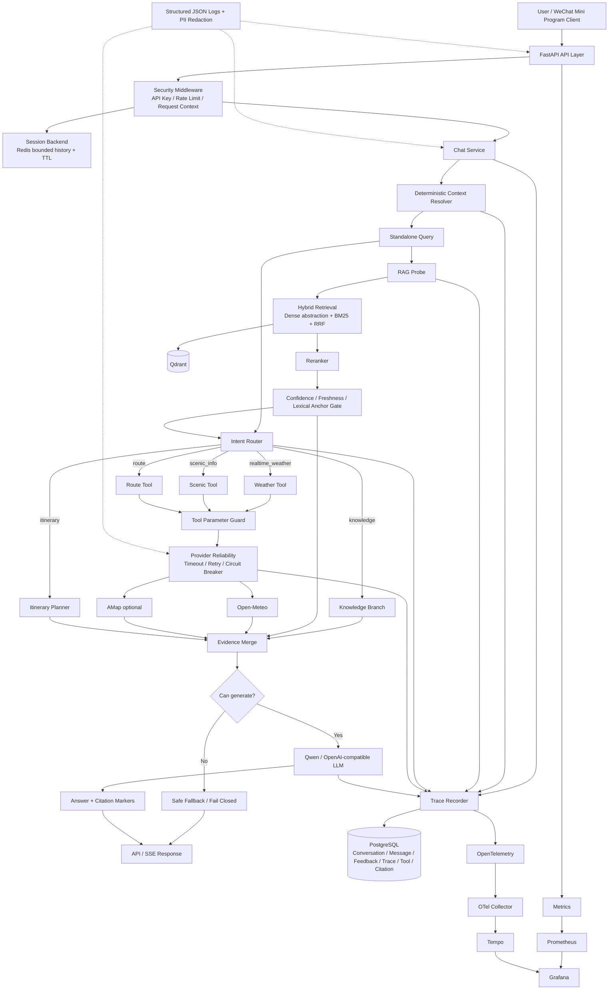
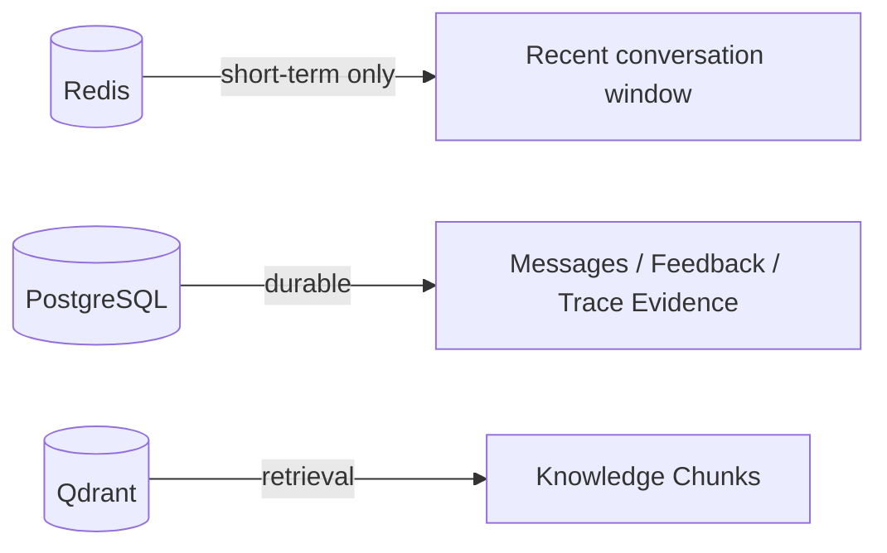
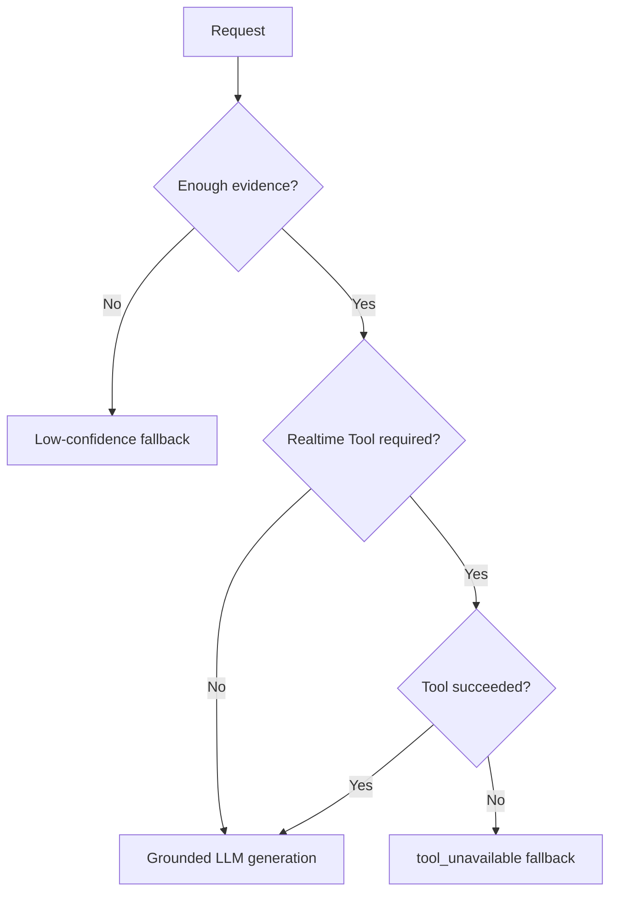

# Final Architecture — Feature-Frozen Baseline

## System diagram



## Request flow

### 1. API and request boundary

FastAPI receives `/chat` or `/chat/stream`. Request middleware establishes an application correlation ID and optional security controls.

The correlation ID is deliberately separate from the native OpenTelemetry Trace ID. It is propagated in the API response/logs and attached to OTel spans for cross-system lookup.

### 2. Session boundary

Redis stores only bounded short-term conversation state with TTL. It is used to supply recent history and should not be confused with the durable audit store.

PostgreSQL is the durable boundary for:

- conversations
- messages
- feedback
- traces
- tool calls
- citations

### 3. Context resolution before routing

A deterministic domain-bounded `ContextResolver` rewrites supported follow-ups such as:

```text
介绍一下象鼻山。
→ 那它明天天气怎么样？
```

into a standalone query such as:

```text
象鼻山明天天气怎么样？
```

The standalone query is used for RAG, Intent routing and Tool parameter parsing. The original user message/history is still preserved for final conversational generation.

### 4. RAG path

RAG uses:

```text
Dense abstraction
+ BM25
→ Reciprocal Rank Fusion
→ Reranker
→ Confidence / Freshness Gate
→ Citation Context
```

Important RC2 protection:

- time-sensitive questions cannot use stale static evidence as current facts;
- Hash Embedding acceptance additionally requires lexical metadata anchoring to reduce deterministic false grounding;
- recognized trailing Prompt-Injection control text is removed from the retrieval query without rewriting the user's factual target.

### 5. Intent and Tool path

The deterministic router currently distinguishes:

```text
knowledge
realtime_weather
scenic_info
route
itinerary
```

Realtime branches enter parameter guards before providers. The LLM does not receive arbitrary network access or arbitrary tool URLs.

Provider reliability adds:

```text
timeout
bounded retry
exponential backoff
circuit breaker
provider attempts / latency / circuit metadata
```

### 6. Evidence merge

RAG evidence and citable Tool evidence are normalized into one `[C#]` context format.

A key invariant introduced by RC2 is:

> If a realtime Tool is required and it fails, static RAG evidence cannot silently convert the turn back into a grounded realtime answer.

The result is `tool_unavailable` + safe fallback instead of hallucinated route/opening/price facts.

### 7. LLM generation

The Qwen/OpenAI-compatible provider is fully environment-configured.

The model receives:

- system policy
- recent conversation history
- original current user message
- trusted-for-facts merged evidence block

Retrieved external content remains explicitly marked untrusted for instructions.

### 8. Streaming and TTFT

`/chat/stream` exposes SSE events including metadata and token deltas. RC2 measures TTFT from request start to the first actual token event rather than using total request latency as a proxy.

### 9. Observability

Each request records a durable application Trace with relevant fields such as:

```text
trace_id
session_id
intent
grounded
gate_reason
tool_calls
citations
provider attempts
provider latency
prompt/completion/total tokens
request latency
status/error
```

Operational telemetry additionally includes:

- JSON structured logs
- P50/P95 process metrics
- Prometheus endpoint
- OpenTelemetry FastAPI/HTTPX instrumentation
- Grafana/Tempo/Collector local deployment configuration

## Data ownership boundaries



Redis is not the durable audit store. Qdrant is not the system-of-record for conversation traces. PostgreSQL is not used as a replacement for vector retrieval.

## Failure strategy



The design preference is explicit degradation over fabricated completion.

## Why the architecture is interview-relevant

This project demonstrates more than an LLM wrapper because the system has explicit boundaries for:

- orchestration
- retrieval quality
- freshness
- Tool permissions
- provider reliability
- short-term vs durable state
- traceability
- migration/security/privacy
- evaluation and Feature Freeze

The strongest engineering story is that RC2 did not merely confirm happy paths: it found concrete architectural defects and forced the system to converge before freeze.

## Frozen limitations

The architecture diagram intentionally does not imply:

- production semantic embedding validation;
- live AMap integration;
- Kubernetes/HA deployment;
- full security certification;
- payment/booking execution;
- model fine-tuning;
- original company production-source ownership.